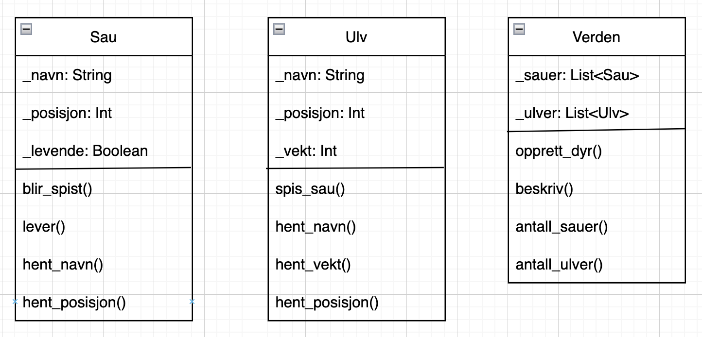

# Spillprosjekt

I dag skal du lage et spill med Python.
Det kan for eksempel være en tekstbasert Ex On The Beach-quiz som kun spilles i terminalen, en flappy-bird-kopi som bruker Pygame eller noe helt annet.
Hva slags spill du lager, og hva spillet skal handle om, velger du selv.

I løpet av dagen skal du jobbe med spillet i fire runder, og levere fire delinnleveringer.

## Vurdering

Prosjektet kommer til å bli vurdert med lav-, middels- eller høy måloppnåelse på kompetansemålene under.

- anvende objektorientert modellering til å beskrive et programs struktur
- utvikle objektorienterte programmer med klasser, objekter, metoder og arv

> Prosjektet handler først og fremst om objektorientert programmering.
> Om du lager et spill i Pygame eller bare et tekstbasert spill i terminalen er ikke så viktig, det viktige er hvordan du setter opp klassene og metodene.
> Kort fortalt: Du kan få høy måloppnåelse uten pygame.

## Plan

### Runde 1 - Planlegging

**Tid:** 9.15 - 10.15  
**Levering:** Skjermbilder av klassediagram

I denne runden skal du planlegge spillet ditt.
Følg punktene under i planleggingen.

1. Finn på tema for spillet.
    - Eks: Farmen Kjendis-quiz

2. Finn ut hvilke *ting* spillet inneholder, disse skal bli klassene i spillet
    - Eks: Tingene i en quiz kan være selve quizzen og spørsmålene, da må spillet ha klassene `Quiz` og `Sporsmal`

3. Finn ut hvilke egenskaper *tingene* i spillet har, dette skal bli instansvariablene til klassene
    - Eks: Quiz kan ha egenskapene rundepoeng, spillernavn, spørsmålsliste, highscore mens spørsmål kan ha egenskapene alternativer og riktig svar.

4. Finn ut hva som skal være mulig å gjøre med *tingene* i spillet , dette skal bli metodene til klassene
    - Eks: For quizzer bør det være mulig å legge til spørsmål, hente poeng, hente highscore, osv. Mens for spørsmål bør det være mulig å skrive spørsmålet i terminalen, gjøre et gjett, hente fasit, osv.


5. Tegn klassediagram av klassene og metodene i spillet
    - Eks: 




## Runde 2 - Koding av klasser og metoder

**Tid:** 10.30 - 11.45   
**Levering:** Python-filer for klasser, frist: 11.45 

I denne runden skal du lage oppsettet for klassene og metodene. 
Hvis du får tid, kan du også starte med koding av metodene.

1. Lag et skall med klasser og tilhørende metoder
    - Eks:

```python
class Quiz:
    def __init__(self):
        self._sporsmaal
        self._poeng
    
    def leggTilSporsmaal(self)
        pass

class Sporsmaal:
    def __init__(self):
        self._oppgavetekst
        self._alternativer
        self._riktig_svar

    def legg_til_alternativ(self):
        pass

    def skriv_alternativer(self):
        pass

    def sjekk_svar(self):
        pass
    
```

1. Lag ferdig instansmetoden 
   - Eks: 

```python
class Sporsmaal:
    def __init__(self, oppgavetekst, riktig_svar):
        self._oppgavetekst = oppgavetekst
        self._alternativer = [riktig_svar]
        self._riktig_svar = riktig_svar
    ...
```

2. Lag ferdig resten av metodene (hvis du har tid)
    - Eks:

```python
    def legg_til_alternativ(self, alternativ):
        self._alternativer.append(alternativ)
```

## Runde 3 - Brukergrensesnitt

**Tid:** 12.30 - 14.00  
**Levering:** Python-filer for klasser, frist: 14.00 

1. Lag ferdig resten av metodene
   - Eks:

```python
    def legg_til_alternativ(self, alternativ):
        self._alternativer.append(alternativ)
```

2. Lag brukergrensesnitt for spillet, altså det som vises når brukeren spiller spillet. 

> Du velger selv om spillet skal bruke pygame, terminalen eller noe annet.


